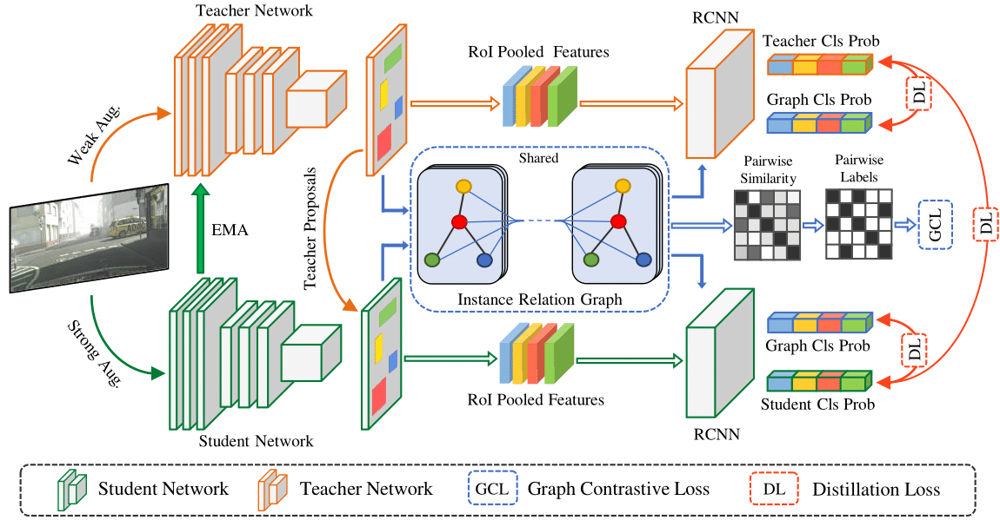

# IRG-SFDA

Official Pytorch Code base for [Instance Relation Graph Guided Source-Free Domain Adaptive Object Detection](https://arxiv.org/abs/2203.15793)

[Paper](https://arxiv.org/abs/2203.15793) | [Project page](https://viudomain.github.io/irg-sfda-web/)

## Introduction

Unsupervised Domain Adaptation (UDA) is an effective approach to tackle the issue of domain shift. Specifically, UDA methods try to align the source and target representations to improve generalization on the target domain. Further, UDA methods work under the assumption that the source data is accessible during the adaptation process. However, in real-world scenarios, the labelled source data is often restricted due to privacy regulations, data transmission constraints, or proprietary data concerns. The Source-Free Domain Adaptation (SFDA) setting aims to alleviate these concerns by adapting a source-trained model for the target domain without requiring access to the source data. In this paper, we explore the SFDA setting for the task of adaptive object detection. To this end, we propose a novel training strategy for adapting a source-trained object detector to the target domain without source data. More precisely, we design a novel contrastive loss to enhance the target representations by exploiting the objects relations for a given target domain input. These object instance relations are modelled using an Instance Relation Graph (IRG) network, which are then used to guide the contrastive representation learning. In addition, we utilize a student-teacher based knowledge distillation strategy to avoid overfitting to the noisy pseudo-labels generated by the source-trained model. Extensive experiments on multiple object detection benchmark datasets show that the proposed approach is able to efficiently adapt source-trained object detectors to the target domain, outperforming previous state-of-the-art domain adaptive detection methods.


<p align="center">
  
</p>


## Using the code:

The code is stable while using Python 3.6.13, CUDA =10.2

- Clone this repository:
```bash
git clone https://github.com/Vibashan/irg-sfda.git
cd irg-sfda/
```

## Detectron2 installation

Please follow [Detectron2 installation](https://detectron2.readthedocs.io/en/latest/tutorials/install.html) for setting up detectron.


## Dependencies

To install all the dependencies using conda:

```bash
conda env create -f environment.yml
conda activate irg_sfda
```


## Dataset Preparation

* **PASCAL_VOC 07+12**: Please follow the instructions in [py-faster-rcnn](https://github.com/rbgirshick/py-faster-rcnn#beyond-the-demo-installation-for-training-and-testing-models) to prepare VOC datasets.
* **Clipart, WaterColor**: Dataset preparation instruction link [Cross Domain Detection ](https://github.com/naoto0804/cross-domain-detection/tree/master/datasets). Images translated by Cyclegan are available in the website.
* **Sim10k**: Website [Sim10k](https://fcav.engin.umich.edu/sim-dataset/)
* **CitysScape, FoggyCityscape**: Download website [Cityscape](https://www.cityscapes-dataset.com/), see dataset preparation code in [DA-Faster RCNN](https://github.com/tiancity-NJU/da-faster-rcnn-PyTorch)

Download all the dataset into "./dataset" folder.
All codes are written to fit for the format of PASCAL_VOC.
For example, the dataset [Sim10k](https://fcav.engin.umich.edu/sim-dataset/) is stored as follows.

```
$ cd ./dataset/Sim10k/VOC2012/
$ ls
Annotations  ImageSets  JPEGImages
$ cat ImageSets/Main/val.txt
3384827.jpg
3384828.jpg
3384829.jpg
.
.
.
```

## Source-trained Model Weights

Download the source-trained model weights in source_model folder [Link](https://drive.google.com/drive/folders/1Aia6wCHPCHGsVk8yQtuByxEyoYm1KfQq?usp=sharing)

## Training SFDA

```
 CUDA_VISIBLE_DEVICES=$GPU_ID python tools/train_st_sfda_net.py 
                    --config-file configs/sfda/sfda_foggy.yaml --model-dir ./source_model/cityscape_baseline/model_final.pth
```

## Testing adapted model

```
CUDA_VISIBLE_DEVICES=$GPU_ID python tools/plain_test_net.py --eval-only 
                    --config-file configs/sfda/sfda_foggy.yaml --model-dir $PATH TO CHECKPOINT
```


### Acknowledgements:

This code-base built on top of [Detectron](https://github.com/facebookresearch/detectron2).

### Citation:
